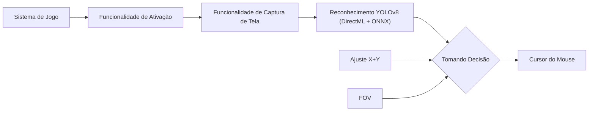

> [!NOTE]
> Se você gosta do VoidShot, por favor considere nos dar uma estrela ⭐! Nós agradecemos! :)
  

    
  

VoidShot é um Mecanismo Universal de Alinhamento de Mira baseado em IA desenvolvido por Comunidade VoidShot para tornar os jogos mais acessíveis para usuários que têm dificuldade em mirar.

Diferente da maioria dos Mecanismos de Alinhamento de Mira baseados em IA, o VoidShot utiliza DirectML, ONNX e YOLOV8 para detectar jogadores, oferecendo maior precisão e desempenho mais rápido comparado a outros Alinhadores de Mira, especialmente em GPUs AMD, que não teriam bom desempenho em Mecanismos de Alinhamento de Mira que utilizam TensorRT.

O VoidShot também fornece uma interface de usuário fácil de usar, um amplo conjunto de recursos e opções de personalização que fazem do VoidShot uma ótima opção para qualquer pessoa que queira usar e adaptar um Mecanismo de Alinhamento de Mira para um jogo específico sem precisar programar.

O VoidShot é 100% gratuito para usar. Isso significa sem anúncios, sem sistema de chaves e sem recursos pagos. O VoidShot não está, e nunca estará à venda para o usuário final, e é considerado um produto de código-disponível, **não código aberto**, pois desencorajamos ativamente outros desenvolvedores de fazer versões comerciais do VoidShot.

Por favor, não confunda o VoidShot como um projeto de código aberto, nós não somos, e nunca fomos um.

## Índice
- [Qual é o propósito do VoidShot?](#qual-é-o-propósito-do-VoidShot)
- [Como o VoidShot funciona?](#como-o-VoidShot-funciona)
- [Recursos](#recursos)
- [Instalação](#instalação)
- [Como o VoidShot é melhor que ferramentas similares baseadas em IA?](#como-o-VoidShot-é-melhor-que-ferramentas-similares-baseadas-em-ia)
- [Como diabos o VoidShot é gratuito?](#como-diabos-o-VoidShot-é-gratuito)
- [Como eu treino meu próprio modelo?](#como-eu-treino-meu-próprio-modelo)
- [Como eu faço upload do meu modelo para o menu "Modelos Disponíveis para Download"](ModelUpload.md)

## Qual é o propósito do VoidShot?
### O VoidShot foi projetado para Jogadores que estão em severa desvantagem em relação aos jogadores normais.
### Isso inclui, mas não se limita a:
- Jogadores com deficiências físicas
- Jogadores com deficiências mentais
- Jogadores que sofrem de deficiências visuais não tratadas/intratáveis
- Jogadores que não têm acesso a um Dispositivo de Interface Humana (HID) separado para controlar o ponteiro
- Jogadores tentando melhorar seu tempo de reação
- Jogadores com coordenação Mão/Olho ruim
- Jogadores que têm desempenho ruim em jogos FPS
- Jogadores que jogam por longos períodos em ambientes quentes, causando mãos suadas que dificultam a mira

## Como o VoidShot funciona?

Quando você pressiona a tecla de ativação, o VoidShot capturará a tela e processará a imagem através do reconhecimento de IA alimentado pelo hardware do seu computador. O resultado desenvolvido será combinado com qualquer ajuste que você fez nos eixos X e Y, e seu FOV atual, resultando em uma mudança na posição do cursor do mouse.

## Recursos
1. Interface Completa
	- O VoidShot fornece uma interface bem projetada e completa para fácil uso e ajuste de jogo.
2. Algoritmo de Detecção de IA DirectML + ONNX + YOLOv8
	- O uso dessas tecnologias permite que o VoidShot seja um dos Mecanismos de Alinhamento de Mira mais precisos e rápidos do mundo
3. Sistema de Personalização Dinâmica
	- O VoidShot fornece um sistema de personalização interativo com vários recursos que atualizam automaticamente a forma como o VoidShot mira conforme você personaliza. Da Confiança da IA ao FOV, o VoidShot facilita para qualquer pessoa ajustar sua mira
4. Sistema Visual Dinâmico
	- O VoidShot contém um sistema ESP universal que destacará o jogador detectado pela IA. Isso é útil para usuários com deficiência visual que têm dificuldade em diferenciar inimigos, e para criadores de configuração tentando depurar suas configurações.
5. Método de Movimento do Mouse
	- O VoidShot concede a você o direito de alternar entre 5 Métodos de Movimento do Mouse dependendo do seu Tipo de Mouse e Jogo para melhor Alinhamento de Mira
6. Troca a Quente
	- O VoidShot permite que você troque modelos e configurações em tempo real. Não há necessidade de reiniciar o VoidShot para fazer suas alterações
7. Loja de Modelos e Configurações com Suporte a Repositório
	- O VoidShot facilita obter quaisquer modelos e configurações que você possa precisar, e com suporte a repositório, você pode se manter atualizado com os modelos e configurações mais recentes de seus criadores favoritos

## Instalação
- Baixe e Instale a versão x64 do [.NET Runtime 8.0.X.X](https://dotnet.microsoft.com/en-us/download/dotnet/thank-you/runtime-desktop-8.0.2-windows-x64-installer)
- Baixe e Instale a versão x64 do [Visual C++ Redistributable](https://aka.ms/vs/17/release/vc_redist.x64.exe)
- Baixe o VoidShot em [Releases](https://github.com/voidworld/VoidShot/releases/latest) (Certifique-se de que é o zip do VoidShot e não o zip Source)
- Extraia o arquivo VoidShot.zip
- Execute o VoidShot.exe
- Escolha seu Modelo e Divirta-se :)

## Como o VoidShot é melhor que ferramentas similares baseadas em IA?
O VoidShot é escrito em C# usando .NET 8 e WPF utilizando bibliotecas pré-existentes como DirectML e ONNX. Isso nos permitiu fazer um Alinhador de Mira muito rápido com alta compatibilidade em GPUs AMD e NVIDIA sem sacrificar a experiência do usuário final.

Além da funcionalidade principal, o VoidShot também adiciona alguns recursos adicionais incríveis como ESP de Detecção para ajudá-lo a ajustar sua experiência de jogo como você preferir.

O VoidShot vem pré-empacotado com um modelo de IA bem treinado com milhares de imagens.

Além desse modelo, o VoidShot fornece dezenas de outros modelos feitos pela comunidade através da loja e nosso servidor do Discord, com mais modelos sendo desenvolvidos todos os dias por outros usuários do VoidShot. Esses modelos variam de jogo para contagem de imagens, tornando o VoidShot incrivelmente versátil e universal para milhares de jogos no mercado agora.

## Como diabos o VoidShot é gratuito?
Como um Alinhador de Mira baseado em IA, o VoidShot não requer nenhum tipo de manutenção porque não lê nenhum dado específico do jogo para realizar suas ações. Se a equipe do VoidShot parar de manter o VoidShot, mesmo que ninguém contribua para fazer um fork e manter o projeto, o VoidShot ainda funcionaria.

Isso significou que, embora atualmente usemos despesas do próprio bolso para executar o VoidShot, essas despesas foram baixas o suficiente para que não tenha sido uma necessidade para o VoidShot funcionar mesmo em um modelo suportado por anúncios.

Não buscamos ganhar dinheiro com o VoidShot, buscamos apenas suas palavras gentis <3, e uma chance de ajudar as pessoas a mirar melhor, assistindo sua mira ou até mesmo para treinar como elas miram (sim, você pode usar o VoidShot dessa forma também)

## Como eu treino meu próprio modelo
Por favor, veja o tutorial em vídeo abaixo sobre como rotular imagens e treinar seu próprio modelo. (Redireciona para o Youtube)

## Como eu faço upload do meu modelo para o menu "Modelos Disponíveis para Download"?
Por favor, leia o tutorial em [UploadModel.md](ModelUpload.md)
